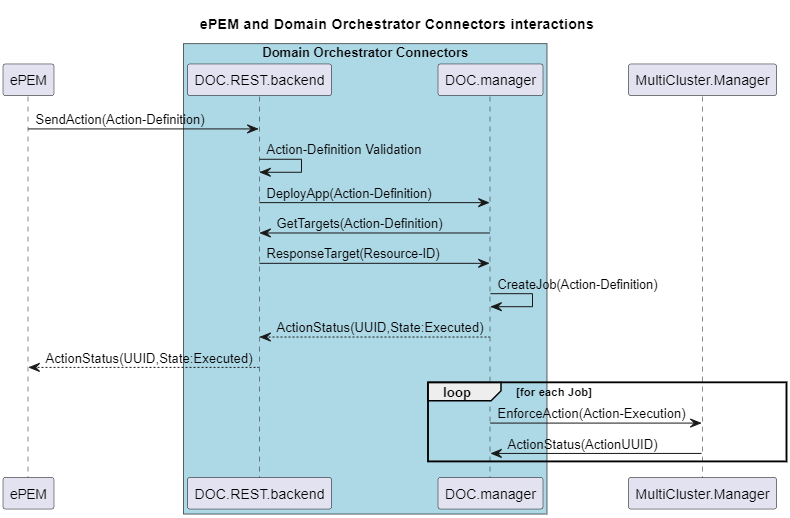

# 📗 Table of Contents
- [project structure](#project-structure)
- [Key Features](#key-features)
- [REST API](#REST-API)
- [Work Flow](#Work-Flow)

## project structure
* [ci]() for ci/cd features
* [docker]() for diferents dockerfile and script to execute and deploy DOC
* [documentation]() for further documentation
* [src]() for golang code source
* [ut]() to include diferent type of unit test

## Key Features

These connectors provide an abstraction between End-to-End Proactive Secure Connectivity Manager (ePEM) Horse component and the multidomain infrastructure, facilitating unified resource management, cross-domain trust and secure licensing, ultimately contributing to Horse project success and efficiency.

## REST API

Through the Nortbound API receive actions to be executed on the infrastructure, as following.

#ToDo add Image

Also, can be requested a list of all actions and its status

Through the Southbound API send actions to the orchestrator for each type of infrastructure. (ON GOING)

## Work Flow
The following images show an example of the work flow to enforce a single action:

## DEPLOYMENT

Build Docker image
    docker build -t doc .

Run container with map ports:
    docker run -p 8080:8080 doc

Test interface manually:
    curl -X POST -d "templates/request.json" -H "Content-Type: application/json" <ContainerIP>:8080/EnforceAction

Test interface with go test:
    cd src/logic
    go test
